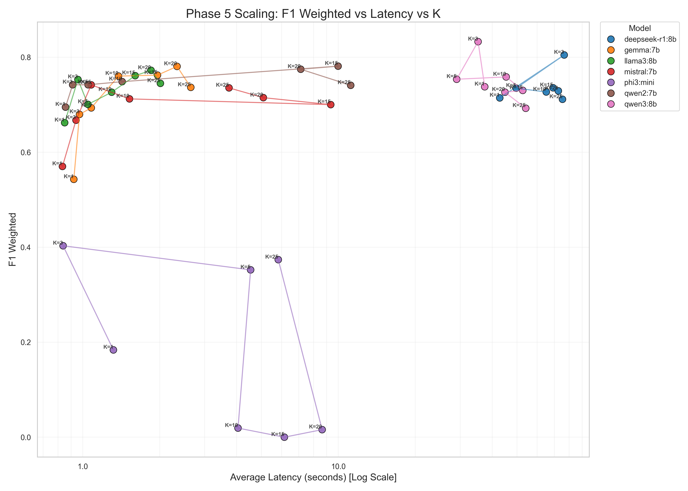
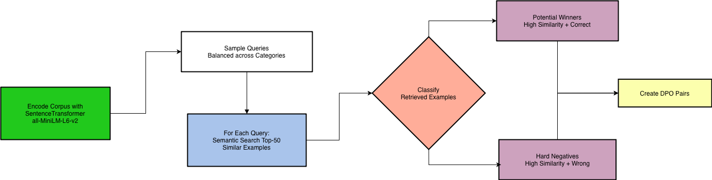

# The Few-shot Dilemma: Over-prompting Large Language Models in Resource-Constrained Environments

## 👥 Authors
* [Cédric Damais](https://github.com/CedricDamais)
* [Yacine Benihaddadene](https://github.com/yass-ML)
* [Amine Mike El Maalouf](https://github.com/Amine-Mike)
* [Léon Ayral](https://github.com/LeoN1203)

---

## 📌 Overview

Large Language Models (LLMs) have revolutionized NLP through In-Context Learning (ICL). However, a common misconception is "the more examples, the better." This project investigates the **"Few-shot Dilemma"** specifically within **Small Language Models (SLMs)** (e.g., Llama 3.2, Phi-3, Qwen).

Unlike massive models, SLMs are constrained by smaller context windows and are more susceptible to attention drift. We systematically explore how **example selection strategies** (Random, Semantic, DPO-Hybrid) and **shot count** ($K$) affect performance.

Our goal: **Maximize performance while minimizing context usage and latency.**

  **Research paper**: [Read the full paper here](reports/paper_final.pdf)

## 🔍 Key Findings

### 1. Quality > Quantity
Naive random selection provides negligible benefits over zero-shot baselines. Our proposed **DPO-Hybrid selector**, which balances semantic similarity with label correctness, achieves substantial improvements.

### 2. The "Reasoning" vs "Heuristic" Split
*   **Reasoning Models (e.g., Qwen3-8B)**: Benefit significantly from DPO selection but suffer from "over-prompting" at high $K$. They peak early ($K=3$).
*   **Heuristic Models (e.g., Llama-3-8B)**: Treat examples as statistical data points and scale better with more examples ($K=20$), but rely heavily on surface-level keyword matching.

### 3. Context Collapse
Smaller models like **Phi-3-Mini** (3.8B) suffer catastrophic performance degradation when the context is overloaded, emphasizing the need for concise, high-quality prompts.

### 4. The Efficiency Frontier
For reasoning tasks, an optimized selection of just **3 examples** ($K=3$) can recover over **80%** of the performance gap between zero-shot and full supervised fine-tuning (SFT).

## 🧪 Methodology

### Evaluated Models
*   **Qwen3** (8B) & **Qwen2** (7B)
*   **Llama-3** (8B)
*   **Mistral** (7B)
*   **Gemma** (7B)
*   **Phi-3-Mini** (3.8B)

### Tasks
1.  **Mathematical Reasoning**: `MATH` dataset (7-way classification).
2.  **Named Entity Recognition**: `Few-NERD` dataset (Entity extraction).

### Selection Strategies
*   **Random**: Naive baseline.
*   **Lexical**: BM25 keyword matching.
*   **Semantic**: Bi-Encoder embeddings (Cosine Similarity).
*   **DPO (Hybrid)**: A custom selector trained using **Direct Preference Optimization** to distinguish between *semantically similar* and *label-correct* examples.

## 📊 Global Benchmark (MATH Task)

| Model | Zero-Shot (Intrinsic) | In-Context (DPO, K=3) | SFT Ceiling (Supervised) | Recovery Rate |
| :--- | :---: | :---: | :---: | :---: |
| **Qwen2-7B** | 0.380 | 0.781 | 0.85 | **85.3%** |
| **Llama-3-8B** | 0.341 | 0.752 | 0.83 | 84.1% |
| **Mistral-7B** | 0.347 | 0.684 | 0.81 | 72.8% |
| **Phi-3-Mini** | 0.268 | 0.389 | 0.67 | 30.1% |

## 🚀 Usage

### Requirements
*   Ollama
*   Python 3.10+
*   `uv` (for dependency management)

## 📚 References

*   **Original Paper**: [Tang et al., 2025] "The Few-shot Dilemma: Over-prompting Large Language Models" ([arXiv:2509.13196](https://arxiv.org/pdf/2509.13196))
*   **Project Report**: [Read the full report here](reports/final_report/main.pdf)

## 📄 License

This project is developed as part of the Advanced NLP course in the SCIA Major at EPITA - École pour l'informatique et les techniques avancées.
